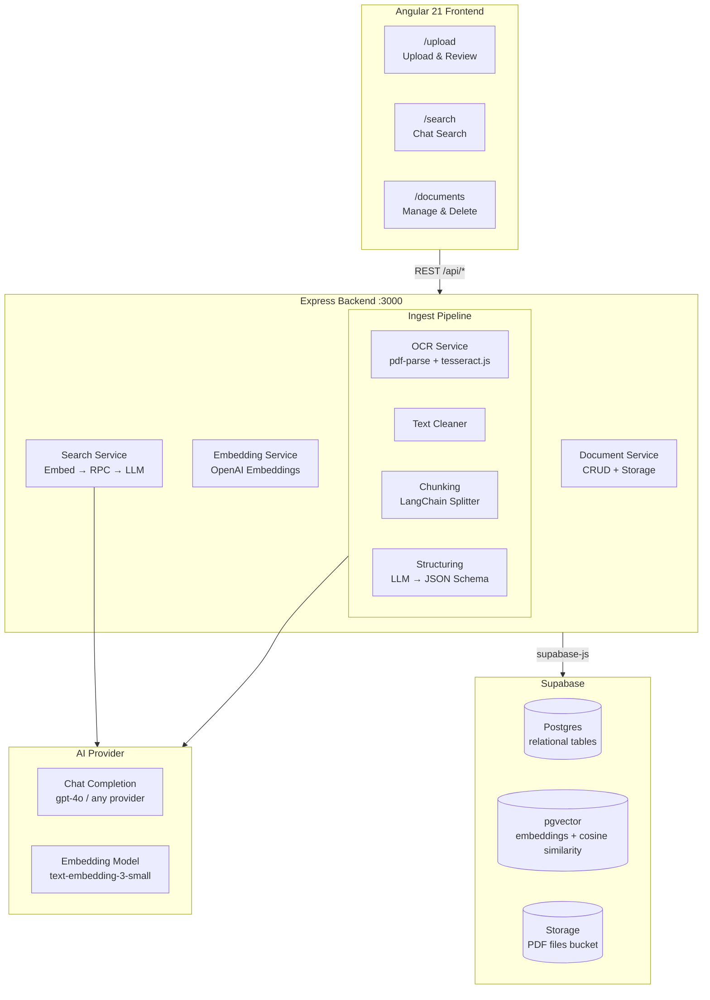
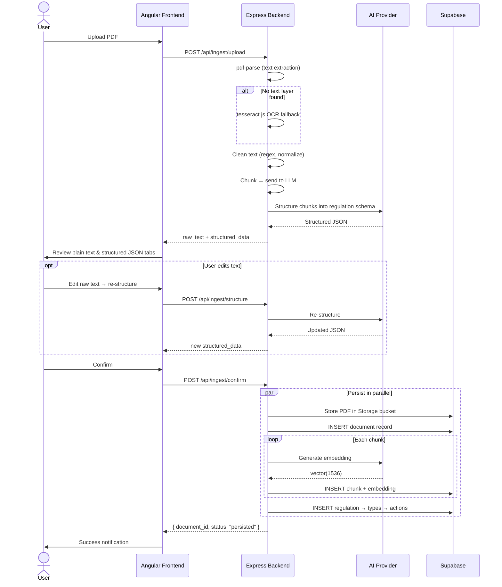
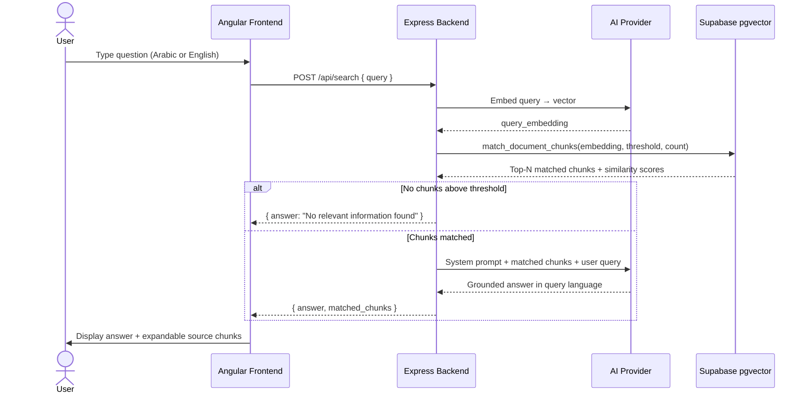
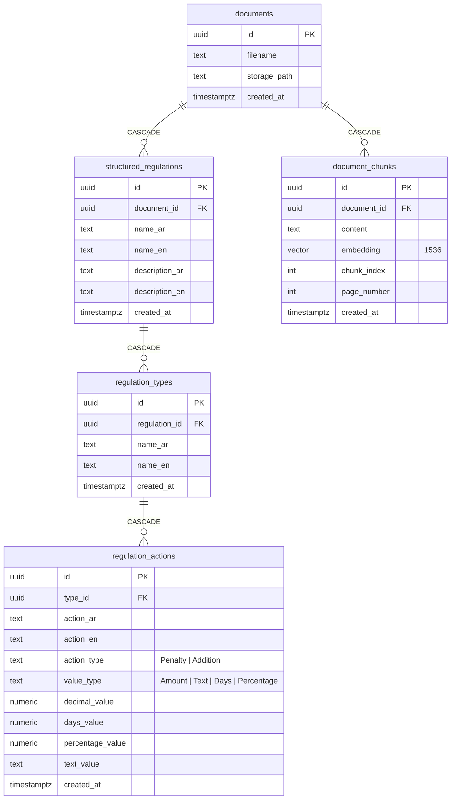

# DocIntelligence

AI-powered document ingestion, structuring, and semantic search. Upload regulatory PDFs, extract and structure their content with LLMs, then search across everything with natural language questions.

## Concept

DocIntelligence takes a regulatory PDF, extracts its text (with OCR fallback for scanned documents), chunks it, and sends it to an LLM to produce a structured schema of regulations, types, and actions (bilingual Arabic/English). The structured data is reviewed and confirmed, embeddings are generated, and everything is persisted. A semantic search engine then lets you ask questions in natural language and get grounded answers backed by the actual document chunks.

### Architecture



### Ingestion Flow



### Search Flow



### Data Model



## Tech Stack

| Layer | Technology |
|---|---|
| **Frontend** | Angular 21 (standalone, signals), Tailwind CSS 4, Vitest |
| **Backend** | Node.js 20+, Express 4, TypeScript |
| **AI / LLM** | OpenAI SDK v4 — provider-agnostic (switch via `AI_PROVIDER_URL`) |
| **PDF extraction** | `pdf-parse` (text layer) + `tesseract.js` (OCR fallback) |
| **Chunking** | `@langchain/textsplitters` (RecursiveCharacterTextSplitter) |
| **Database** | Supabase — Postgres (relational) + pgvector (semantic search) |
| **File storage** | Supabase Storage |
| **Testing** | Vitest + supertest (backend), Vitest + TestBed (frontend) |

## Getting Started

### Prerequisites

- Node.js 20+
- npm 11+
- A Supabase project with pgvector enabled
- An AI provider API key (OpenAI, OpenRouter, etc.)

### Setup

**1. Clone and install dependencies**

```bash
cd backend
cp .env.example .env
# Edit .env with your keys
npm install

cd ../frontend
cp .env.example .env
npm install
```

**2. Supabase setup**

Run the migration SQL in your Supabase SQL editor:

```bash
cat backend/supabase/migration.sql
```

Create the `documents` storage bucket in the Supabase dashboard (set to private).

**3. Configure environment**

Edit `backend/.env`:

```env
AI_API_KEY=sk-...
AI_MODEL=gpt-4o
AI_EMBEDDING_MODEL=text-embedding-3-small
SUPABASE_URL=https://your-project.supabase.co
SUPABASE_SERVICE_ROLE_KEY=your-service-role-key
```

**4. Run**

Terminal 1 — backend:

```bash
cd backend
npm run dev          # http://localhost:3000
```

Terminal 2 — frontend:

```bash
cd frontend
npm start            # http://localhost:4200
```

The frontend dev server proxies `/api/*` requests to the backend.

### API Endpoints

| Method | Path | Description |
|---|---|---|
| `GET` | `/api/health` | Health check |
| `POST` | `/api/ingest/upload` | Upload PDF, extract text and structure |
| `POST` | `/api/ingest/structure` | Re-structure edited text |
| `POST` | `/api/ingest/confirm` | Persist PDF + embeddings + structured data |
| `DELETE` | `/api/ingest/cancel/:id` | Discard an upload |
| `POST` | `/api/search` | Semantic search with grounded LLM answer |
| `GET` | `/api/documents` | List all documents |
| `GET` | `/api/documents/:id/download` | Download original PDF |
| `DELETE` | `/api/documents/:id` | Delete document (cascade) |

### Key Env Vars

| Variable | Default | Description |
|---|---|---|
| `AI_API_KEY` | *required* | AI provider API key |
| `AI_MODEL` | *required* | Chat model (e.g. `gpt-4o`) |
| `AI_EMBEDDING_MODEL` | `AI_MODEL` | Embedding model |
| `AI_PROVIDER_URL` | OpenAI default | Custom base URL for provider swap |
| `SUPABASE_URL` | *required* | Supabase project URL |
| `SUPABASE_SERVICE_ROLE_KEY` | *required* | Supabase service role key |
| `SIMILARITY_THRESHOLD` | `0.7` | Min cosine similarity for search matches |
| `MATCH_COUNT` | `4` | Max chunks per search |
| `CHUNK_SIZE` | `1000` | Characters per chunk |
| `CHUNK_OVERLAP` | `200` | Overlap between chunks |

## Project Structure

```
embedding-documents-ai-app/
├── backend/
│   ├── src/
│   │   ├── config/          # Env vars, OpenAI/Supabase clients
│   │   ├── controllers/     # Route handlers
│   │   ├── middleware/       # Error handler, timeout, upload, async wrapper
│   │   ├── models/          # TypeScript interfaces
│   │   ├── routes/          # Express route definitions
│   │   └── services/        # OCR, chunking, structuring, embedding, search, document
│   ├── supabase/            # SQL migrations and storage setup
│   └── tests/               # Unit + integration tests
├── frontend/
│   └── src/app/
│       ├── components/      # FileUpload, PlainTextEditor, StructuredForm, ChatInput, etc.
│       ├── models/          # TypeScript interfaces
│       ├── pages/           # UploadPage, SearchPage, DocumentsPage
│       └── services/        # API, Ingest, Search, Document services
└── specs/001-document-ocr-search/  # Feature spec, data model, tasks, quickstart
```

## License

MIT
